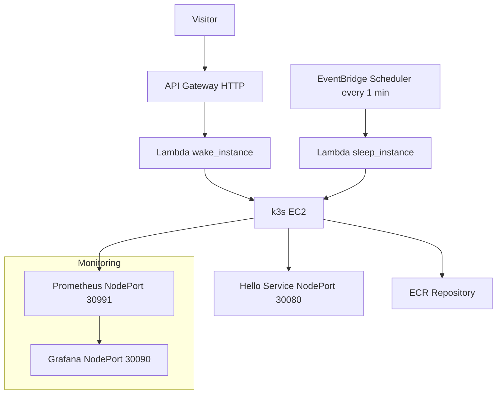

# Helmkube Autowake — k3s on EC2 with Wake/Sleep

**Live demo:** https://app.helmkube.site/

## Architecture (Mermaid)



> If GitHub fails to render Mermaid in your browser, the syntax above is still valid; try viewing on the GitHub web UI or enable Mermaid support.

## Project structure

```
.
├── .git
├── .github
├── app
│   └── public
├── charts
│   └── hello
└── infra
    ├── build
    ├── lambda
    ├── templates
    ├── providers.tf
    ├── variables.tf
    └── helm.tf
```

## Quick start

```bash
# 1) Build & push the demo image to ECR (optional if already pushed)
cd infra
terraform init
terraform apply -auto-approve
```

## Notes
- NodePort for app: **30080**
- Grafana NodePort: **30090** (admin only, restrict in SG)
- Prometheus NodePort: **30991** (admin only, restrict in SG)
- Alertmanager NodePort: **30992** if enabled (admin only)
