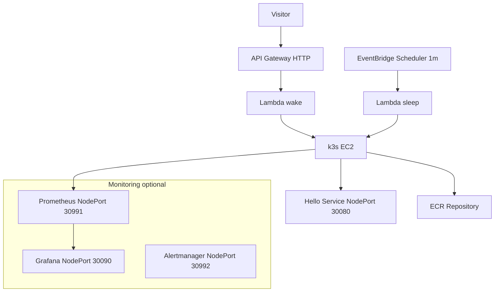

# 🚀 helmkube‑autowake‑cicd

Spin up a **cost‑efficient k3s demo** on a single EC2 instance with an **auto‑wake / auto‑sleep** workflow, **Helm‑deployed app**, and optional **Prometheus + Grafana** monitoring. Ideal for portfolio and interviews: clean Terraform, small footprint, and a polished Live Demo.

**Live Demo:** https://app.helmkube.site/

---

## Architecture (Mermaid)


_If GitHub fails to render Mermaid, open the README in a browser with Mermaid enabled. The syntax above is valid._

---

## What you get

- **k3s on EC2 (Amazon Linux 2023)** with EIP, SSM, IMDSv2, hardened SG.
- **Helm‑deployed sample app** served via **NodePort**.
- **Auto‑wake** via API Gateway → Lambda and **auto‑sleep** via EventBridge → Lambda.
- **Optional monitoring**: Prometheus, Grafana (admin password in SSM `SecureString`).
- **Clean Terraform layout** with inline kube creds for providers and GitHub‑ready docs.

---

## Repository structure (top‑level)

```
.
├── .git
├── .github
├── app
│   └── public
├── charts
│   └── hello
└── infra
    ├── build
    ├── lambda
    ├── templates
    ├── providers.tf
    ├── variables.tf
    └── helm.tf
```
_This is a concise view meant for the README. Your repo contains additional .tf files that compose the full working stack._

---

## Quick start

### 1) Prerequisites
- Terraform **1.6+**
- AWS CLI configured for **us‑east‑1**
- Docker (optional: for local image build/push)

### 2) Configure variables
Edit `infra/terraform.tfvars` and set:
- `project_name`, `admin_ip`, `node_port`, and (optionally) `image_tag`.
- You already keep secrets out of state; SSM `SecureString` is used for Grafana.

### 3) Build and push the app image (optional — or use any public image)
```bash
cd infra
aws ecr get-login-password --region us-east-1 \
| docker login --username AWS --password-stdin <ACCOUNT_ID>.dkr.ecr.us-east-1.amazonaws.com

docker build -t hello:latest ../app
docker tag hello:latest <ACCOUNT_ID>.dkr.ecr.us-east-1.amazonaws.com/helmkube-autowake/hello-app:latest
docker push <ACCOUNT_ID>.dkr.ecr.us-east-1.amazonaws.com/helmkube-autowake/hello-app:latest
```
**Notes:** The block logs in to ECR, builds the demo app, tags it for your ECR repo, and pushes.

### 4) Deploy
```bash
cd infra
terraform init -input=false
terraform apply -auto-approve -input=false
```
**Notes:** Initializes backend/providers and applies the full stack (EC2, API, Lambdas, Helm, monitoring).

### 5) Test the app
```bash
# 1) Wake via API (browser):
open https://app.helmkube.site/

# 2) Or from CLI (prints HTTP status):
curl -I https://app.helmkube.site/
```
**Notes:** The wake Lambda starts EC2 if needed and serves the app on the configured NodePort.

---

## Security group & ports (quick reference)

- **App NodePort**: `30080` — **open to 0.0.0.0/0** (public demo access)
- **k3s API**: `6443` — **admin IP only** (e.g., `A.B.C.D/32`)
- **Grafana**: `30090` — **admin IP only** (toggle via `expose_grafana`)
- **Prometheus**: `30991` — **admin IP only** (toggle via `expose_prometheus`)
- **Alertmanager**: `30992` — **admin IP only** (toggle via `expose_alertmanager`)
- **Egress**: full — required for SSM, package installs, ECR pulls, etc.

> If metrics look incomplete, ensure your admin IP ingress rules are present and the kubelet/Prometheus scrapes aren’t blocked by the SG. Opening **only** the three NodePorts plus `6443` to your `/32` is sufficient for the demo.

---

## Common operations

```bash
# Show key outputs
cd infra
terraform output

# Tail Lambda logs (replace names if customized)
aws logs tail /aws/lambda/helmkube-autowake-wake --follow --region us-east-1
aws logs tail /aws/lambda/helmkube-autowake-sleep --follow --region us-east-1

# Check k3s readiness (after kubeconfig is fetched to infra/build/k3s-embed.yaml)
kubectl --kubeconfig infra/build/k3s-embed.yaml get nodes -o wide
kubectl --kubeconfig infra/build/k3s-embed.yaml get svc,deploy,pods -A -o wide
```
**Notes:** Outputs show URLs, IDs, and helpful hints. CloudWatch tails Lambda logs. `kubectl` checks cluster state.

---

## Troubleshooting

- **Mermaid fails to render on GitHub** — Your diagram is valid; some clients disable Mermaid. View from a browser with Mermaid enabled.
- **Wake loops / app slow to appear** — The wake Lambda polls for readiness. If your instance is cold, give it 1–3 minutes.
- **Grafana/Prometheus unreachable** — Confirm admin IP NodePorts are open and the SG is attached to the instance.
- **SSM association logs** — Look in the S3 bucket `${project_name}-assoc-logs/ssm-assoc/` and CloudWatch log groups prefixed with `/ssm/assoc/`.

---

## Cleanup

```bash
cd infra
terraform destroy -auto-approve -input=false
```
**Notes:** Tears down API, Lambdas, ECR (force delete), EC2, and monitoring resources created by this stack.

---

## License

MIT
