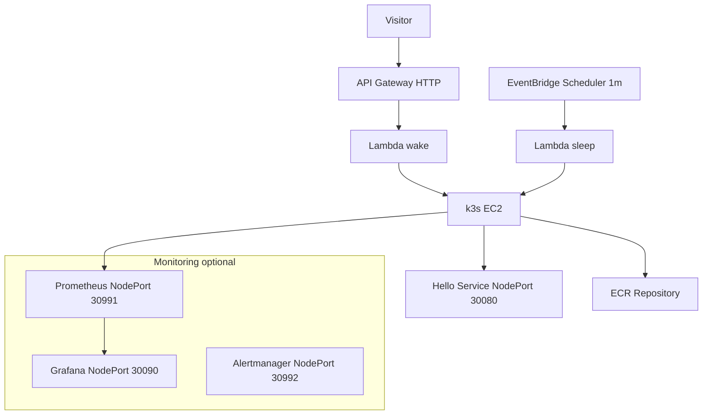

<p align="center">
  
  
  
  
  
  
  
  
  
  
</p>
<p align="center">
  
  
  
  
  
  
  
  

</p>

# Helmkube Autowake — CI/CD Kubernetes Demo

##  Live Demo
**Wake Page:** https://app.helmkube.site/  
The EC2 instance wakes on demand (1–3 minutes depending on cold/warm state).

---

##  Overview
**Helmkube Autowake** is a production-style Kubernetes environment designed for demos, portfolio, and interviews.  
It uses a single Amazon Linux 2023 EC2 instance running **k3s**, deployed dynamically through **Terraform**, launched by a **serverless wake workflow**, and shut down automatically by a **sleep scheduler**.

The stack demonstrates:
- On-demand compute via **API Gateway → Lambda → EC2**
- Declarative **Helm** deployments for application & monitoring
- AWS-native automation for wake & sleep lifecycle
- Kubernetes observability (Prometheus, Grafana)
- Clean Infrastructure-as-Code structure with Terraform

This project showcases real DevOps and Cloud Engineering skills — not just scripted demos.

---

##  Tech Stack Summary
- **AWS:** EC2, Lambda, API Gateway, EventBridge, S3, IAM, ECR, SSM Parameter Store  
- **Kubernetes:** k3s single-node, Helm  
- **Observability:** Prometheus, Alertmanager, Grafana, kube-state-metrics, node-exporter  
- **IaC:** Terraform (modular, production-grade), SSM automation, IAM least privilege  
- **CI/CD:** GitHub Actions (build → push → deploy)  
- **Security:** SG hardening, admin-only NodePorts, secrets via SSM, no NAT Gateway  

---

## Requirements

- **AWS Account**
  - Access to EC2, Lambda, API Gateway, EventBridge, S3, ECR, IAM, SSM

- **CLI Tools**
  - `awscli` (v2 recommended)
  - `kubectl`
  - `helm`
  - `terraform` (1.6+)

- **Local Environment**
  - macOS / Linux / WSL2  
  - Docker installed (for app image builds)

- **GitHub Setup**
  - GitHub Actions enabled  
  - OIDC trust established between GitHub → AWS IAM

- **Network Requirements**
  - One **Elastic IP** (static)  
  - Admin IP (your home IP) for NodePort access

- **Optional (Monitoring)**
  - +1–2 GB free memory on EC2 for Prometheus/Grafana
  - Internet access for pulling OCI charts

 ---

## Architecture (Mermaid)


---


##  Components

### Compute & Orchestration
- EC2 (Amazon Linux 2023)
- k3s Kubernetes distribution
- Helm application chart
- Optional monitoring stack (Prometheus, Grafana, Alertmanager)

### Automation & Control Plane
- Lambda functions: `wake_instance`, `sleep_instance`
- API Gateway (HTTP endpoint)
- EventBridge Scheduler (1-minute interval)

### Infrastructure Services
- Terraform Infrastructure-as-Code
- SSM Parameter Store (Grafana password, configs)
- Amazon ECR (application image registry)
- CloudWatch Logs & S3 log bucket (Lambda/SSM logging)

---

## **Project Structure**

```
helmkube-autowake-cicd
├── app/                     # Demo Node.js app (hello service)
├── charts/                  # Helm chart for k3s deployment
├── docs/                    # Architecture, SLO, cost, ADRs, runbooks
├── infra/                   # Terraform IaC (EC2, k3s, Lambda, API, ECR, SSM)
├── lambda/                  # Lambda sources (wake/sleep)
├── templates/               # EC2 user_data.sh template
├── wait-site/               # Static wake page (CloudFront+S3)
├── .github/                 # Workflows + issue/PR templates
├── .tflint.hcl              # Lint rules
├── LICENSE                  # MIT license for the project
└── README.md
```
**Full detailed structure:** see [`docs/architecture.md`](./docs/architecture.md)

---

##  Documentation

This repository includes full, production-grade project documentation covering architecture, operations, security, and decision-making.

### **System Architecture**
- [Architecture Overview](./docs/architecture.md)
- [Architecture Diagrams (Mermaid)](./docs/diagrams/architecture.md)
- [Sequence Flow (wake → healthcheck → sleep)](./docs/diagrams/sequence.md)

### **Design Decisions (ADR)**
- [ADR-001 — Why k3s Single Node](./docs/adr/adr-001-why-k3s-single-node.md)
- [ADR-002 — Why Terraform for IaC](./docs/adr/adr-002-why-terraform-for-iac.md)
- [ADR-003 — Wake/Sleep Lifecycle Design](./docs/adr/adr-003-wake-sleep-lifecycle-design.md)
- [ADR-004 — Security Boundaries & SSM](./docs/adr/adr-004-security-boundaries-and-ssm.md)

### **Operations & Reliability**
- [Runbook — Wake Failure](./docs/runbooks/wake-failure.md)
- [Runbook — Destroy Not Triggered](./docs/runbooks/destroy-not-triggered.md)
- [Runbook — Rollback Procedure](./docs/runbooks/rollback.md)

### **Monitoring & Observability**
- [Monitoring Overview (Prometheus, Alertmanager, Grafana)](./docs/monitoring.md)
- [SLOs — Wake Time & Readiness](./docs/slo.md)
- [Screenshots & Evidence](./docs/screenshots/)

### **Security**
- [Threat Model & Security Boundaries](./docs/threat-model.md)

### **Cost Optimization**
- [Cost Model & Savings](./docs/cost.md)

---

##  Why This Project Matters
This is not a “Hello World cluster”.  
It demonstrates **real production principles**:

- On-demand compute lifecycle (wake → run → sleep)
- Automated IaC provisioning and destruction
- Serverless orchestration of EC2
- Secure, optimized single-node Kubernetes for demos
- Full observability: dashboards, alerts, metrics scraping
- Cost-efficient architecture (no NAT, no ELB, minimal EC2 uptime)
- Clean project layout suitable for senior-level code review
  
---

#  Lessons Learned
- How to reduce EC2 → k3s cold-start time using optimized cloud-init  
- Ensuring Helm waits for API readiness before deployment  
- Securing NodePort access with admin-IP-only rules  
- Fixing SSM associations by adding missing IAM trust and logging  
- Handling transitional EC2 states inside the wake Lambda  
- Keeping Terraform readable, modular, and suitable for professional review  
- Pulling monitoring dashboards into a lightweight single-node cluster  

---

#  Troubleshooting — Problems & How They Were Solved

| Problem | Root Cause | Solution |
|--------|------------|----------|
| Slow wake-up time | k3s API not fully ready | Added readiness polling & boot wait loops |
| Grafana unreachable | Admin IP not whitelisted | Corrected security group NodePort ingress rules |
| Wake Lambda looping | EC2 stuck in transitional states | Added state validation, retries, and backoff |
| Prometheus scrape gaps | Wrong selectors / blocked ports | Fixed labels, ports, and security group rules |
| SSM associations “silent failing” | Missing IAM permissions/logging | Updated IAM trust and enabled S3 + CloudWatch logs |
| Helm deploy inconsistent | k3s not yet accepting connections | Added retry logic and Kubernetes readiness checks |

---

##  Security & CI

### Terraform CI Pipeline

This repository uses an automated GitHub Actions workflow — **terraform-ci**, triggered:

- on every pull request,
- when Terraform files under `infra/` change,
- manually via workflow_dispatch.

The pipeline performs full Terraform quality checks:

- `terraform fmt` — formatting  
- `terraform validate` — syntax & schema validation  
- `tflint` — best-practice linting  
- `tfsec` — security scanning

This ensures that all IaC changes pass through strict automated validation.

---

### Security Scans (tfsec)

`tfsec` performs a full AWS security audit across:

- IAM policies  
- Security Groups  
- S3 encryption  
- DynamoDB encryption  
- Lambda tracing  
- ECR encryption  
- CloudWatch log groups  
- and more

Final status after cleanup:

```
critical             0
high                 0
medium               0
low                  0

No problems detected!
```

---

### Why some checks are ignored

A small number of `tfsec` rules are intentionally ignored using `#tfsec:ignore`, because:

- public NodePort is required by design,
- AWS-managed SSE (`AES256`) is sufficient for demo projects,
- CMK encryption is unnecessary for temporary SSM logs,
- strict prod-grade rules would slow down development with no benefit.

These exceptions are explicitly documented in the code next to each ignore.

---

#  Deployment

## 1) Initialize Terraform

    cd infra
    terraform init -input=false

## 2) Deploy the full stack

    terraform apply -auto-approve -input=false

This provisions:
- IAM roles  
- EC2 instance  
- Lambda functions (wake & sleep)  
- API Gateway (HTTP endpoint)  
- S3 log bucket  
- SSM Parameter Store secrets  
- ECR references  
- Monitoring stack (optional)  
- Helm application deployment  

## 3) Test the wake endpoint

    open https://app.helmkube.site/

Or using CLI:

    curl -I https://app.helmkube.site/

## 4) Check k3s readiness after wake

    kubectl --kubeconfig infra/build/k3s-embed.yaml get nodes -o wide
    kubectl --kubeconfig infra/build/k3s-embed.yaml get svc,pods,deploy -A -o wide

## 5) Tail Lambda logs

    aws logs tail /aws/lambda/helmkube-autowake-wake --follow
    aws logs tail /aws/lambda/helmkube-autowake-sleep --follow


#  Cost Optimization

- **Auto-sleep EC2**  
  Instance automatically stops when idle, reducing monthly cost close to zero.

- **Single-node k3s instead of EKS**  
  No control-plane charges, no load balancers — dramatically cheaper.

- **Optional monitoring stack**  
  Prometheus/Grafana can be disabled via Terraform variables to save compute.

- **Serverless control plane**  
  Lambda, API Gateway, and EventBridge run in low/free-tier pricing.

- **Minimal ECR usage**  
  Only one lightweight demo image is stored and pulled.

- **No NAT Gateway required**  
  Outbound traffic uses public interface → saves ~$32/month per month.


#  Future Work (What I Would Improve Next)

If I continued developing this platform, I would focus on:

- **Strengthening CI/CD** — splitting validation, linting, security scans, and adding drift detection.
- **Deepening observability** — integrating Loki + Tempo for full metrics/logs/traces in one place.
- **Improving global performance** — optional CloudFront caching for faster cold-wakes worldwide.
- **Enhancing governance** — introducing policy-as-code with OPA/Conftest and Checkov.
- **Increasing reliability** — synthetic uptime checks, SLOs for wake latency, and automated rollback if k3s fails readiness.
- **Expanding the application** — evolving it into a small multi-service example with its own CI pipeline.

These steps push the project closer to a production-grade, review-ready platform. 

---

# ❓ FAQ

**How long does wake-up take?**  
Usually 1–3 minutes depending on cold/warm state of the EC2 instance.

**Where is the kubeconfig stored?**  
It is generated into:  
`build/k3s-embed.yaml`

**Can I deploy my own Docker image?**  
Yes — push your image to ECR and update Helm values in the hello chart.

**Can this project run in any AWS region?**  
Yes — just update the provider region and AMI filters.

**Is monitoring required?**  
No — Prometheus, Grafana, and Alertmanager are optional (controlled via Terraform variables).

**Does this require a NAT Gateway?**  
No — which significantly reduces cost.

### ❓ Why does the app redirect from HTTPS → HTTP?

The wake page (https://app.helmkube.site/) is HTTPS because it’s served by CloudFront + S3.

But the application itself runs on a NodePort inside k3s, exposed directly on the EC2 public IP.
NodePort does not provide TLS termination and isn’t behind a Load Balancer.

Therefore the app is accessed over plain HTTP, which is expected for single-node k3s setups.

---

#  Screenshots
## Cluster Resource Overview

**Shows:** total CPU usage, memory usage, request/limit commitment, and live cluster-wide resource consumption.

## Node Pods Resource Usage

**Shows:** per-pod CPU & memory usage on the single EC2 node, including Prometheus, Grafana, Traefik, metrics-server, and demo workload.

## Workload (hello) Metrics

**Shows:** CPU & RAM usage of the demo workload `hello`, proving Prometheus scraping works and metrics flow into Grafana dashboards.

## Cluster Networking (RX/TX Bandwidth)

**Shows:** per-namespace network throughput (monitoring, kube-system, default), RX/TX rates, and packet flow across the cluster.

## Alertmanager Overview

**Shows:** Alertmanager alert rate, alert delivery graph, and confirms alerting pipeline is functioning with Prometheus operator stack.

## Prometheus Targets

**Shows:** all Prometheus scrape targets (ServiceMonitors) are UP: kubelet, apiserver, coredns, node-exporter, kube-state-metrics, Grafana, Alertmanager.

## Kubernetes Nodes & Pods

**Shows:** EC2 node status + full list of all pods across all namespaces, with READY/STATUS columns—verifying healthy k3s cluster.

## Kubernetes Services

**Shows:** all cluster services including Traefik LoadBalancer, Prometheus NodePorts, Grafana NodePort, metrics-server, kube-dns.

## EC2 Instance (DescribeInstance)

**Shows:** EC2 instance type, private IP, AMI, IAM Instance Profile, launch time—proves AWS infra layer is healthy and configured.

## Security Group (Inbound Rules)

**Shows:** controlled inbound traffic: admin-only ports for Grafana/Prometheus/k3s API, NodePort app open to 0.0.0.0/0 for demo.

---

## License

Released under the MIT License.  
See the LICENSE file for full details.

Branding name “🚀 Ruslan AWS” and related visuals may not be reused or rebranded without permission.