# Helmkube Autowake — Production-Style CI/CD Kubernetes Platform

<p align="center">
  
  
  
  
  
  
  
</p>

## Live Environment
Wake Endpoint: https://app.helmkube.site/  
The EC2 instance starts on demand (typically 1–3 minutes depending on cold or warm state).

---

## Overview

I built Helmkube Autowake as a production-style Kubernetes platform that balances operational realism with cost efficiency.

It runs a single Amazon Linux 2023 EC2 instance with k3s, provisioned through Terraform, triggered by a serverless wake workflow, and automatically stopped by a scheduled sleep process to eliminate idle compute spend.

This platform demonstrates:

- On-demand infrastructure lifecycle using API Gateway → Lambda → EC2
- Declarative application and monitoring deployments via Helm
- Automated wake/sleep orchestration using AWS-native services
- Secure Kubernetes access with controlled NodePorts and admin-only exposure
- Observability stack with Prometheus and Grafana
- Clean, modular Infrastructure-as-Code structured for professional review

The goal was not simply to run Kubernetes, but to design and operate a cost-aware, automation-driven platform aligned with production engineering principles.

---

## Tech Stack

- AWS: EC2 (Amazon Linux 2023), Lambda, API Gateway (HTTP), EventBridge Scheduler, S3, IAM, ECR, SSM Parameter Store  
- Kubernetes: k3s (single-node control plane), Helm for application and monitoring deployments  
- Observability: Prometheus, Alertmanager, Grafana, kube-state-metrics, node-exporter  
- Infrastructure as Code: Terraform (modular structure, remote state, IAM least privilege)  
- CI/CD: GitHub Actions (lint → validate → build → push → deploy)  
- Security: Hardened Security Groups, admin-restricted NodePorts, secrets via SSM, no NAT Gateway to minimize attack surface

---

## Requirements

### AWS
- An AWS account with permissions to use:
  - EC2, Lambda, API Gateway (HTTP), EventBridge Scheduler  
  - S3 (state/logs), ECR, IAM, SSM Parameter Store

### CLI Tools
- `awscli` (v2 recommended)
- `terraform` (1.6+)
- `kubectl`
- `helm`

### Local Environment
- macOS, Linux, or WSL2
- Docker (required for building and pushing the application image)

### GitHub Integration
- GitHub Actions enabled
- OIDC trust relationship configured between GitHub and AWS IAM

### Networking
- One static **Elastic IP**
- Your current public admin IP for restricted NodePort access

### Optional (Monitoring Stack)
- Additional 1–2 GB memory on the EC2 instance (for Prometheus and Grafana)
- Internet access for pulling Helm/OCI charts

 ---

## Architecture (Mermaid)

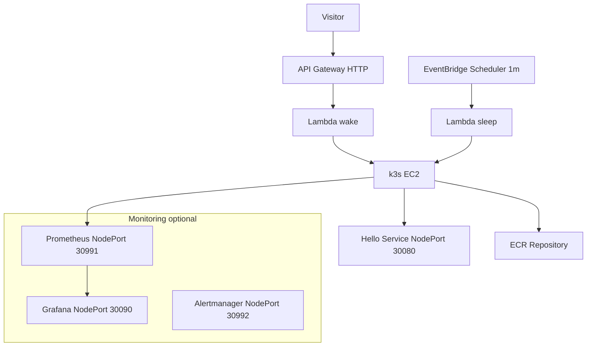
---

## Components

### Compute & Kubernetes Layer
- EC2 (Amazon Linux 2023) running a single-node k3s control plane
- Helm-managed workloads (application and optional monitoring stack)
- Monitoring stack: Prometheus, Grafana, Alertmanager

### Automation & Lifecycle Control
- Lambda functions: `wake_instance` and `sleep_instance`
- API Gateway (HTTP) as the external wake trigger
- EventBridge Scheduler (1-minute interval) for idle detection and shutdown

### Infrastructure & Platform Services
- Terraform for full infrastructure provisioning
- SSM Parameter Store for secrets and runtime configuration
- Amazon ECR for container image storage
- CloudWatch Logs and S3 for Lambda and SSM execution logging

---

## Project Structure

```
helmkube-autowake-cicd
├── app/                     # Sample application workload
├── charts/                  # Helm chart for k3s deployment
├── docs/                    # Architecture, SLO, cost, ADRs, runbooks
├── infra/                   # Terraform IaC (EC2, k3s, Lambda, API, ECR, SSM)
├── lambda/                  # Lambda sources (wake/sleep)
├── templates/               # EC2 user_data.sh template
├── wait-site/               # Static wake page (CloudFront+S3)
├── .github/                 # Workflows + issue/PR templates
├── .tflint.hcl              # Lint rules
├── LICENSE                  # MIT license for the project
└── README.md
```

---

## Documentation

[docs](./docs/) · [diagrams](./docs/diagrams/) · [adr](./docs/adr/) · [runbooks](./docs/runbooks/) · [screenshots](./docs/screenshots/)

---

## Why This Project Matters

This is not a basic Kubernetes setup.  
I designed this platform to reflect real production trade-offs between cost, automation, security, and operational reliability.

It demonstrates:

- On-demand compute lifecycle management (wake → run → sleep)
- Fully automated Infrastructure-as-Code provisioning and teardown
- Serverless orchestration controlling stateful compute
- Secure, minimal single-node Kubernetes architecture
- Integrated observability with metrics, dashboards, and alerting
- Cost-aware design (no NAT Gateway, no load balancers, minimized EC2 uptime)
- Clean, review-ready repository structure aligned with senior-level expectations

---

## Lessons Learned

- Optimizing EC2 → k3s cold-start time using tuned cloud-init and readiness polling  
- Ensuring Helm deployment only occurs after Kubernetes API becomes responsive  
- Designing security groups that balance strict access control with operational usability  
- Debugging and stabilizing SSM associations through proper IAM trust and logging  
- Handling transitional EC2 states inside serverless wake/sleep logic  
- Structuring Terraform for clarity, modularity, and long-term maintainability  
- Running a full monitoring stack efficiently inside a constrained single-node cluster

---

## Troubleshooting — Engineering Challenges & Resolutions

| Issue | Root Cause | Resolution |
|-------|------------|------------|
| Slow wake-up time | Kubernetes API not fully initialized after EC2 start | Implemented readiness polling and controlled boot wait loops |
| Grafana unreachable | Admin IP not included in Security Group rules | Corrected restricted NodePort ingress configuration |
| Wake Lambda looping | EC2 instance stuck in transitional states (pending/stopping) | Added explicit state validation, retry logic, and exponential backoff |
| Prometheus scrape gaps | Incorrect selectors and blocked scrape ports | Fixed label selectors and aligned Security Group rules |
| SSM associations silently failing | Missing IAM trust policies and insufficient logging | Corrected IAM trust configuration and enabled S3 + CloudWatch logging |
| Helm deployment inconsistent | k3s API not yet accepting connections | Introduced Kubernetes readiness checks and controlled Helm retries |

---

## Security & CI

### Terraform CI Pipeline

This repository includes a dedicated GitHub Actions workflow — **terraform-ci** — acting as a quality gate for all Infrastructure-as-Code changes.

The workflow is triggered:
- On every pull request
- When Terraform files under `infra/` are modified
- Manually via `workflow_dispatch`

It performs comprehensive validation checks:

- `terraform fmt` — enforced formatting standards  
- `terraform validate` — configuration and schema validation  
- `tflint` — Terraform best-practice linting  
- `tfsec` — static security analysis of AWS resources  

This pipeline ensures that infrastructure changes are syntactically valid, stylistically consistent, and security-reviewed before being merged.

---

### Security Scans (tfsec)

`tfsec` performs a full AWS security audit across:

- IAM policies  
- Security Groups  
- S3 encryption  
- DynamoDB encryption  
- Lambda tracing  
- ECR encryption  
- CloudWatch log groups  
- and more

Final status after cleanup:

```
critical             0
high                 0
medium               0
low                  0

No problems detected!
```

---

### Why Some Security Checks Are Intentionally Ignored

A limited number of `tfsec` findings are explicitly suppressed using `#tfsec:ignore` where the behavior is intentional and aligned with the platform design.

These cases include:

- Public NodePort exposure required for direct application access
- Use of AWS-managed SSE (`AES256`) where customer-managed CMK provides no additional practical benefit
- Temporary SSM log storage where full KMS encryption would add unnecessary complexity
- Controls that are valid for large-scale production systems but disproportionate for a single-node, cost-optimized architecture

All exceptions are documented inline in the Terraform code to ensure transparency and maintainability.

---

#  Deployment

## 1) Initialize Terraform

    cd infra
    terraform init -input=false

## 2) Deploy the full stack

    terraform apply -auto-approve -input=false

This provisions:
- IAM roles  
- EC2 instance  
- Lambda functions (wake & sleep)  
- API Gateway (HTTP endpoint)  
- S3 log bucket  
- SSM Parameter Store secrets  
- ECR references  
- Monitoring stack (optional)  
- Helm application deployment  

## 3) Test the wake endpoint

    open https://app.helmkube.site/

Or using CLI:

    curl -I https://app.helmkube.site/

## 4) Check k3s readiness after wake

    kubectl --kubeconfig infra/build/k3s-embed.yaml get nodes -o wide
    kubectl --kubeconfig infra/build/k3s-embed.yaml get svc,pods,deploy -A -o wide

## 5) Tail Lambda logs

    aws logs tail /aws/lambda/helmkube-autowake-wake --follow
    aws logs tail /aws/lambda/helmkube-autowake-sleep --follow


## Cost Optimization

- On-demand EC2 lifecycle eliminates idle compute spend.
- k3s instead of EKS removes control-plane costs.
- Optional monitoring reduces memory overhead.
- Serverless orchestration minimizes baseline charges.
- No NAT Gateway to avoid fixed monthly fees.


## Future Work

- Stronger CI/CD governance and drift detection.
- Full observability stack with metrics, logs, and traces.
- Global performance tuning for cold-start reduction.
- Policy-as-code and compliance validation.
- Formal reliability targets and rollback automation.
- Multi-service workload expansion.

---

# FAQ

**How long does wake-up take?**  
Typically 1–3 minutes depending on whether the EC2 instance is in a cold or warm state.

**Where is the kubeconfig stored?**  
Generated locally at:  
`build/k3s-embed.yaml`

**Can I deploy my own container image?**  
Yes. Push your image to Amazon ECR and update the Helm chart values accordingly.

**Can this platform run in any AWS region?**  
Yes. Update the Terraform provider region and AMI filters as needed.

**Is the monitoring stack required?**  
No. Prometheus, Grafana, and Alertmanager are optional and controlled via Terraform variables.

**Is a NAT Gateway required?**  
No. The architecture avoids NAT Gateway usage to minimize recurring cost.

---

### Why does the application redirect from HTTPS to HTTP?

The wake endpoint (`https://app.helmkube.site/`) is served via CloudFront and S3, which provides TLS termination.

The application itself runs as a Kubernetes NodePort service exposed directly on the EC2 public IP.  
NodePort does not provide TLS termination and is not placed behind a Load Balancer in this architecture.

As a result, the workload is accessed over HTTP by design in this single-node, cost-optimized setup.

---

#  Screenshots
## Cluster Resource Overview
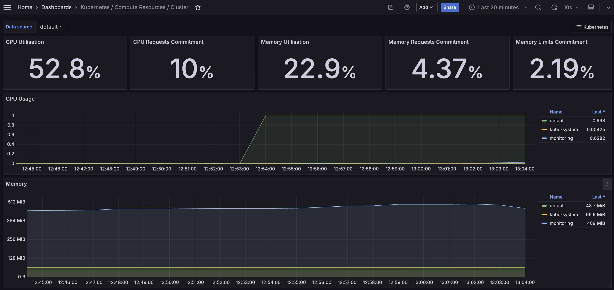
**Shows:** total CPU usage, memory usage, request/limit commitment, and live cluster-wide resource consumption.

## Node Pods Resource Usage
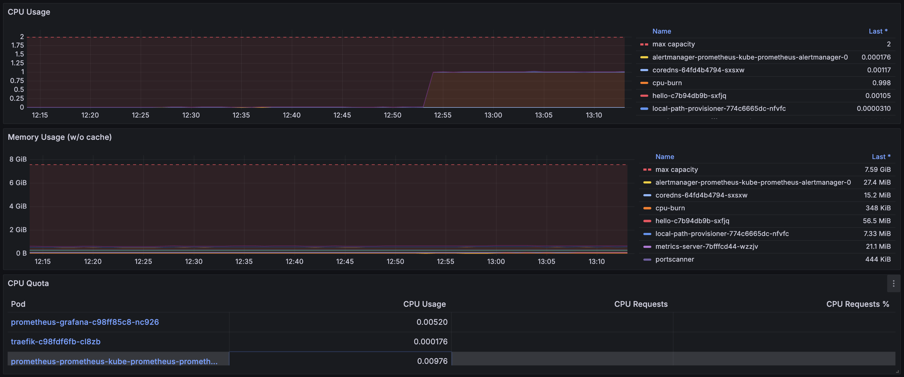
**Shows:** Per-pod CPU and memory usage on the single EC2 node, including Prometheus, Grafana, Traefik, metrics-server, and the application workload.

## Workload (hello) Metrics
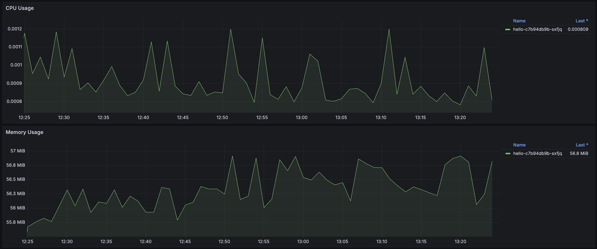
**Shows:** CPU and memory usage of the `hello` application workload, demonstrating active Prometheus scraping and metric ingestion into Grafana dashboards.

## Cluster Networking (RX/TX Bandwidth)
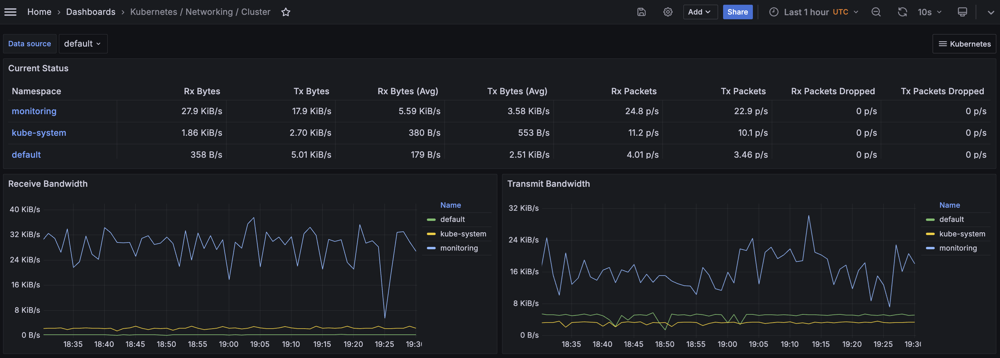
**Shows:** per-namespace network throughput (monitoring, kube-system, default), RX/TX rates, and packet flow across the cluster.

## Alertmanager Overview
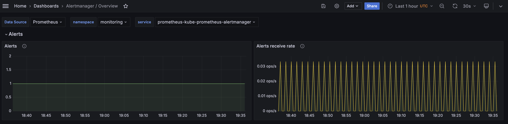
**Shows:** Alertmanager alert rate, alert delivery graph, and confirms alerting pipeline is functioning with Prometheus operator stack.

## Prometheus Targets
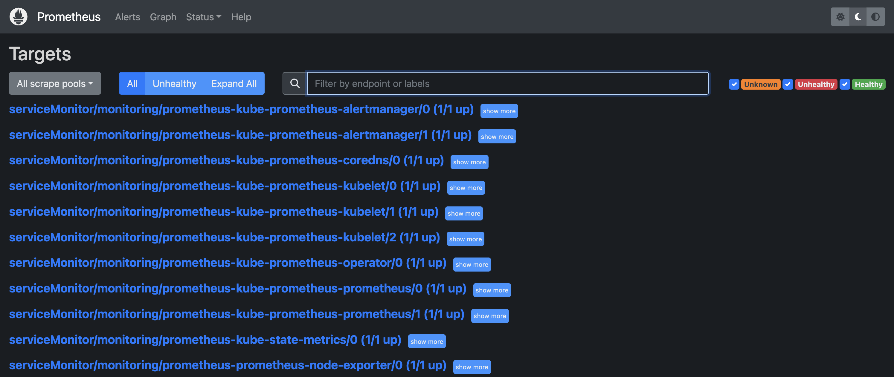
**Shows:** all Prometheus scrape targets (ServiceMonitors) are UP: kubelet, apiserver, coredns, node-exporter, kube-state-metrics, Grafana, Alertmanager.

## Kubernetes Nodes & Pods
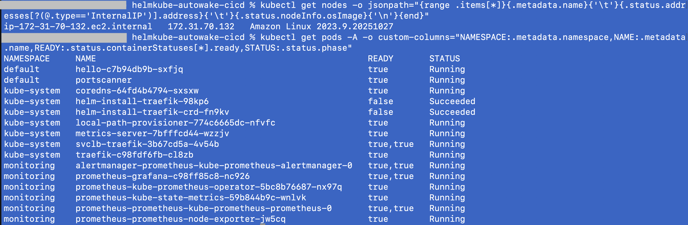
**Shows:** EC2 node status + full list of all pods across all namespaces, with READY/STATUS columns—verifying healthy k3s cluster.

## Kubernetes Services
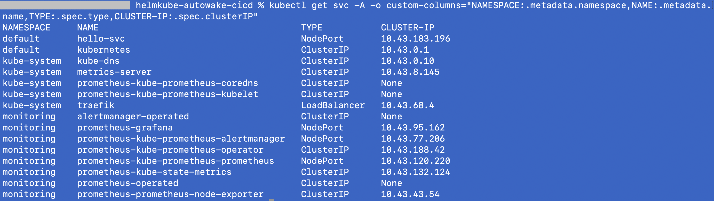
**Shows:** all cluster services including Traefik LoadBalancer, Prometheus NodePorts, Grafana NodePort, metrics-server, kube-dns.

## EC2 Instance (DescribeInstance)
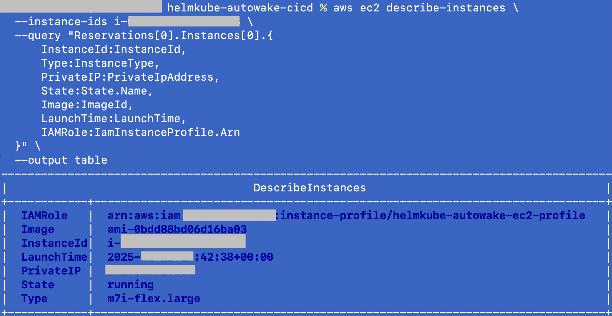
**Shows:** EC2 instance type, private IP, AMI, IAM Instance Profile, launch time—proves AWS infra layer is healthy and configured.

## Security Group (Inbound Rules)
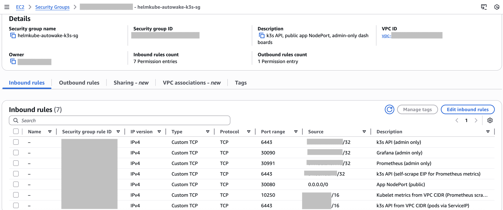
**Shows:** Controlled inbound traffic configuration — admin-restricted access for Grafana, Prometheus, and the k3s API, with the application NodePort intentionally exposed for public access.

---

## License

This project is released under the MIT License.

See the `LICENSE` file for details.