# 🚀 Helmkube Autowake — k3s on EC2 with ECR, Helm, and Wake/Sleep API

> Minimal, portfolio-ready stack: a single k3s node on EC2 runs your app via a Helm chart from ECR, **auto-wakes** on traffic and **auto-sleeps** when idle. Optional Prometheus + Grafana with fixed NodePorts.

**Live demo:** https://app.helmkube.site/

---

## Architecture (Mermaid)

```mermaid
flowchart TD
  U["Visitor / Client"]
  GW["API Gateway (HTTP)"]
  W["Lambda • wake_instance"]
  EC2["EC2 (k3s, AL2023)"]
  APP["Hello Service<br/>NodePort 30080"]
  ECR["ECR Repository"]

  P["Prometheus<br/>NodePort 30991"]
  G["Grafana<br/>NodePort 30090"]
  AM["Alertmanager<br/>NodePort 30992"]

  SCHED["EventBridge Scheduler<br/>(every 1 min)"]
  SLP["Lambda • sleep_instance"]

  U --> GW --> W --> EC2 --> APP
  EC2 --> ECR
  EC2 --> P --> G
  P --> AM
  SCHED --> SLP --> EC2
```



---

## What you get

- **k3s on EC2 (Amazon Linux 2023)** — single node for simplicity and low cost.
- **Hello app via Helm** — container image stored in **ECR**; pull secret is created automatically.
- **Wake endpoint** — **API Gateway (HTTP) → Lambda** starts the EC2 and redirects to the app.
- **Auto-sleep** — **EventBridge Scheduler → Lambda** stops EC2 after `idle_minutes` with no heartbeat.
- **Optional monitoring** — **kube-prometheus-stack** (Prometheus + Grafana + Alertmanager) exposed via fixed NodePorts.
- **Security-first defaults** — dashboards bound to your `/32` admin IP; app NodePort public; everything else egress-only.
- **Clean Terraform layout** — providers + variables split; comments explain intent.

---

## Repository structure (focus view)

```text
.
├── .git
├── .github
├── app
│   └── public
├── charts
│   └── hello
└── infra
    ├── build
    ├── lambda
    ├── templates
    ├── providers.tf
    ├── variables.tf
    └── helm.tf
```

---

## Quick start

```bash
cd infra
terraform init
terraform apply -auto-approve
```

---

## Ports & URLs

| Component | Port | Exposure | Notes |
|------------|------|-----------|--------|
| App (Hello) | 30080 | Public | NodePort |
| Grafana | 30090 | Admin only | NodePort |
| Prometheus | 30991 | Admin only | NodePort |
| Alertmanager | 30992 | Admin only (optional) | NodePort |
| k3s API | 6443 | Admin + VPC CIDR | |
| Kubelet metrics | 10250 | VPC CIDR | Prometheus scrape |

---

## Security group summary

- Allow 30080 (public app)
- Allow 6443 (admin + VPC CIDR)
- Allow 30090, 30991, 30992 (admin only)
- Allow 10250 (VPC CIDR)
- Egress all

---

## Cleanup

```bash
cd infra
terraform destroy -auto-approve
```

---

## License

MIT
