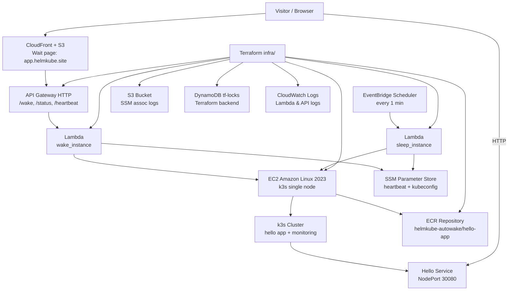

```mermaid
flowchart TD

  User[Visitor / Browser] --> CF[CloudFront + S3<br/>Wait page: app.helmkube.site]
  CF --> APIGW[API Gateway HTTP<br/>/wake, /status, /heartbeat]
  APIGW --> Lwake[Lambda<br/>wake_instance]

  Lwake --> EC2[EC2 Amazon Linux 2023<br/>k3s single node]
  EC2 --> K8S[k3s Cluster<br/>hello app + monitoring]
  K8S --> App[Hello Service<br/>NodePort 30080]
  User -->|HTTP| App

  Sched[EventBridge Scheduler<br/>every 1 min] --> Lsleep[Lambda<br/>sleep_instance]
  Lsleep --> EC2

  EC2 --> ECR[ECR Repository<br/>helmkube-autowake/hello-app]
  Lwake --> SSM[SSM Parameter Store<br/>heartbeat + kubeconfig]
  Lsleep --> SSM

  TF[Terraform infra/] --> EC2
  TF --> Lwake
  TF --> Lsleep
  TF --> APIGW
  TF --> ECR
  TF --> S3logs[S3 Bucket<br/>SSM assoc logs]
  TF --> DDB[DynamoDB tf-locks<br/>Terraform backend]
  TF --> CW[CloudWatch Logs<br/>Lambda & API logs]
```