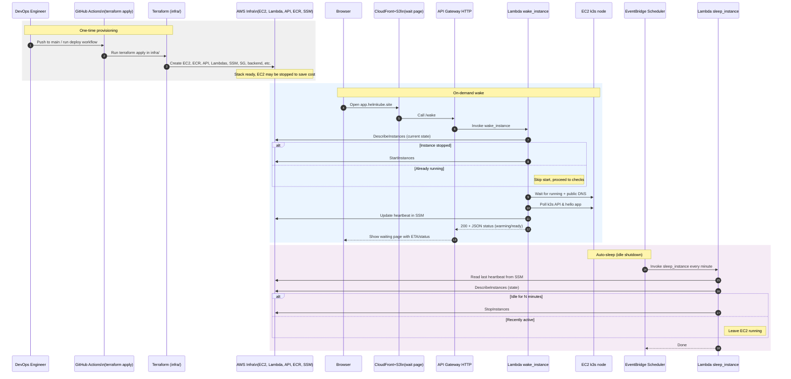

```mermaid
sequenceDiagram
autonumber

participant Dev as DevOps Engineer
participant GH as GitHub Actions\n(terraform apply)
participant TF as Terraform (infra/)
participant AWS as AWS Infra\n(EC2, Lambda, API, ECR, SSM)
participant User as Browser
participant CF as CloudFront+S3\n(wait page)
participant API as API Gateway HTTP
participant LW as Lambda wake_instance
participant EC2 as EC2 k3s node
participant Sched as EventBridge Scheduler
participant LS as Lambda sleep_instance

rect rgb(240,240,240)
  Note over Dev,TF: One-time provisioning
  Dev->>GH: Push to main / run deploy workflow
  GH->>TF: Run terraform apply in infra/
  TF->>AWS: Create EC2, ECR, API, Lambdas, SSM, SG, backend, etc.
  Note over AWS: Stack ready, EC2 may be stopped to save cost
end

rect rgb(235,245,255)
  Note over User,EC2: On-demand wake
  User->>CF: Open app.helmkube.site
  CF->>API: Call /wake
  API->>LW: Invoke wake_instance

  LW->>AWS: DescribeInstances (current state)
  alt Instance stopped
    LW->>AWS: StartInstances
  else Already running
    Note right of LW: Skip start, proceed to checks
  end

  LW->>EC2: Wait for running + public DNS
  LW->>EC2: Poll k3s API & hello app
  LW->>AWS: Update heartbeat in SSM
  LW-->>API: 200 + JSON status (warming/ready)
  API-->>User: Show waiting page with ETA/status
end

rect rgb(245,235,245)
  Note over Sched,EC2: Auto-sleep (idle shutdown)
  Sched->>LS: Invoke sleep_instance every minute
  LS->>AWS: Read last heartbeat from SSM
  LS->>AWS: DescribeInstances (state)
  alt Idle for N minutes
    LS->>AWS: StopInstances
  else Recently active
    Note right of LS: Leave EC2 running
  end
  LS-->>Sched: Done
end
```